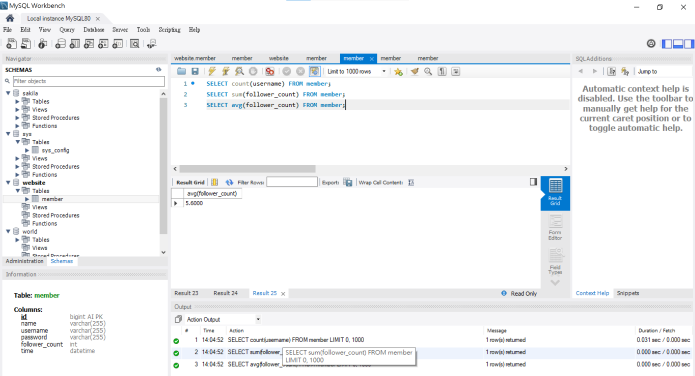

    #Request2
    CREATE DATABASE website;
    use website;
    CREATE TABLE member(
    id bigint not null key auto_increment,
    name varchar(255) collate utf8mb4_unicode_ci null,
    username varchar(255) collate utf8mb4_unicode_ci not null,
    password varchar(255) collate utf8mb4_unicode_ci not null,
    follower_count int not null default 0,
    time datetime not null default current_timestamp()
    )

    #Request3
    insert into member(name,username,password,follower_count)
    value('testla','test', 'test',5);
    insert into member(name,username,password,follower_count)
    value('apple','testa', 'testa',5);
    insert into member(name,username,password,follower_count)
    value('bear','testb', 'testb',6);
    insert into member(name,username,password,follower_count)
    value('cola','testc', 'testc',6);
    insert into member(name,username,password,follower_count)
    value('deer','testd', 'testd',6);
    SELECT * FROM member;
    SELECT * FROM member ORDER BY time;
    SELECT * FROM member ORDER BY time LIMIT 1,3;
    SELECT * from member WHERE username='test';
    SELECT * from member WHERE username='test' and password='test';
    SET SQL_SAFE_UPDATES=0;
    UPDATE member SET name='test2' WHERE username='test';
    SET SQL_SAFE_UPDATES=1;

    #Request4
    SELECT count(username) FROM member;
    SELECT sum(follower_count) FROM member;
    SELECT avg(follower_count) FROM member;

    #Request5
    mysql> create table message(
    -> id bigint not null key auto_increment,
    -> member_id bigint not null references member(id),
    -> content varchar(255) collate utf8mb4_unicode_ci not null,
    -> time datetime not null default current_timestamp(),
    -> \G
    
    mysql> SELECT content, member_id, name
    -> FROM member JOIN message ON member_id=member.id
    -> \G
    
    mysql> SELECT username='test', member_id, content
    -> FROM member JOIN message ON member_id=member.id
    -> \G
    

